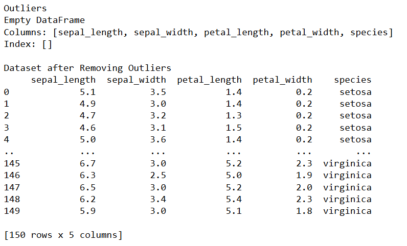
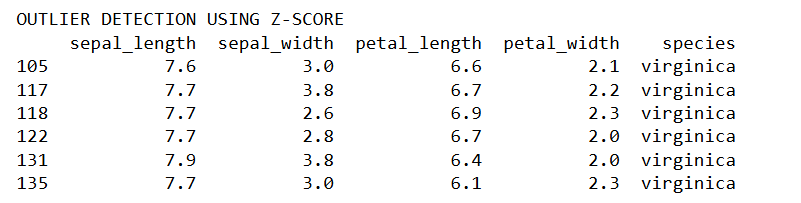

# Exno:1
Data Cleaning Process

# AIM
To read the given data and perform data cleaning and save the cleaned data to a file.

# Explanation
Data cleaning is the process of preparing data for analysis by removing or modifying data that is incorrect ,incompleted , irrelevant , duplicated or improperly formatted. Data cleaning is not simply about erasing data ,but rather finding a way to maximize datasets accuracy without necessarily deleting the information.

# Algorithm
STEP 1: Read the given Data

STEP 2: Get the information about the data

STEP 3: Remove the null values from the data

STEP 4: Save the Clean data to the file

STEP 5: Remove outliers using IQR

STEP 6: Use zscore of to remove outliers

# Coding and Output:

## PROGRAM:
~~~
import pandas as pd
import numpy as np
from scipy import stats
import matplotlib.pyplot as plt

df = pd.read_csv("iris.csv")

print("Original Dataset")
print(df.head())

print("\nDROPNA")
dropna_df = df.dropna()
print(dropna_df)

print("\nFILLNA")
fillna_df = df.fillna(0)
print(fillna_df)

print("\nFORWARD FILL")
ffill_df = df.fillna(method='ffill')
print(ffill_df)

print("\nINTERPOLATE")
interpolate_df = df.interpolate()
print(interpolate_df)

print("\nREMOVE DUPLICATES")
duplicate_df = df.drop_duplicates()
print(duplicate_df)

print("\nOUTLIER DETECTION USING IQR")

data = df['sepal_length']

# Quartiles
Q1 = data.quantile(0.25)
Q3 = data.quantile(0.75)

# IQR
IQR = Q3 - Q1

# Limits
lower = Q1 - 1.5 * IQR
upper = Q3 + 1.5 * IQR

# Detect Outliers
outliers = df[(data < lower) | (data > upper)]

print("\nOutliers")
print(outliers)

# Remove Outliers
new_df = df[(data >= lower) & (data <= upper)]

print("\nDataset after Removing Outliers")
print(new_df)

# Before Removing Outliers
plt.figure(figsize=(6,5))

plt.boxplot(
    data,
    patch_artist=True,
    boxprops=dict(facecolor='skyblue'),
    medianprops=dict(color='red'),
    whiskerprops=dict(color='blue'),
    capprops=dict(color='black'),
    flierprops=dict(marker='o',
                    markerfacecolor='red',
                    markersize=8)
)

plt.title("Before Removing Outliers", color='darkblue')
plt.ylabel("Sepal Length", color='green')
plt.grid(True)
plt.show()

# After Removing Outliers
plt.figure(figsize=(6,5))

plt.boxplot(
    new_df['sepal_length'],
    patch_artist=True,
    boxprops=dict(facecolor='lightgreen'),
    medianprops=dict(color='red'),
    whiskerprops=dict(color='green'),
    capprops=dict(color='black'),
    flierprops=dict(marker='o',
                    markerfacecolor='orange',
                    markersize=8)
)

plt.title("After Removing Outliers", color='darkgreen')
plt.ylabel("Sepal Length", color='purple')
plt.grid(True)
plt.show()

print("\nOUTLIER DETECTION USING Z-SCORE")

z = np.abs(stats.zscore(data))

threshold = 2

z_outliers = df[z > threshold]

print(z_outliers)

~~~

## OUTPUT:

ORIGINAL DATA:

1.dropna():

2.fillna():

3.ffill():

4.Remove Duplicates():

5.Interpolate():

6.Outlier():

7.Z-SCORE:

# Result:
Thus, the data cleaning process was successfully completed in Python using Pandas, NumPy, and Matplotlib libraries.
