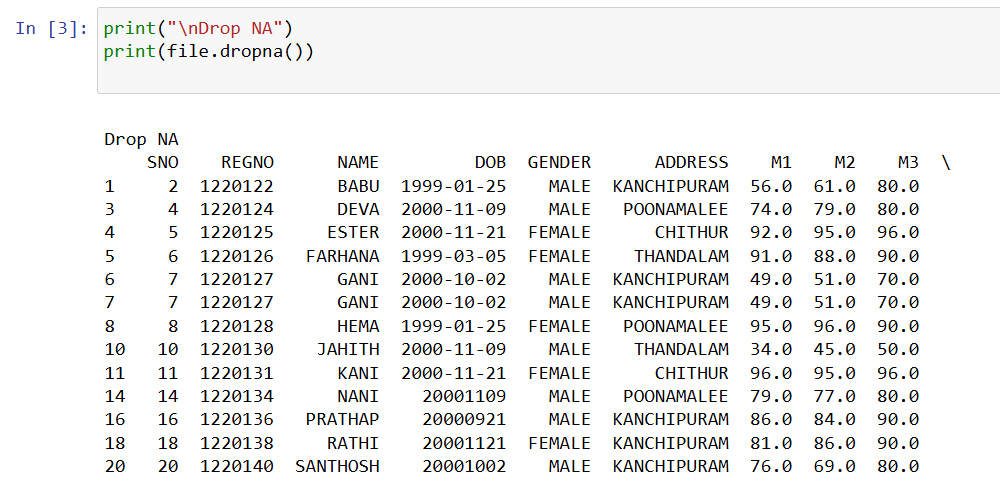
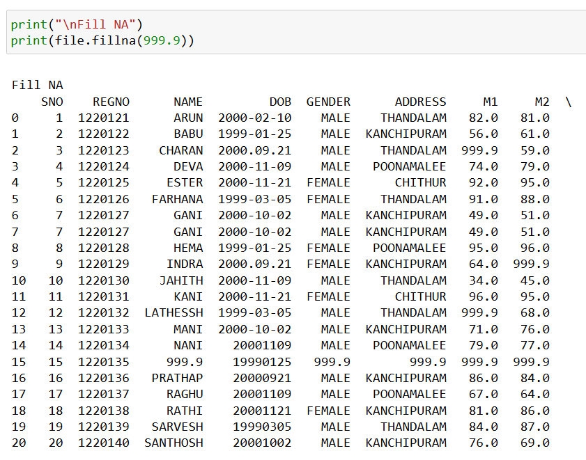
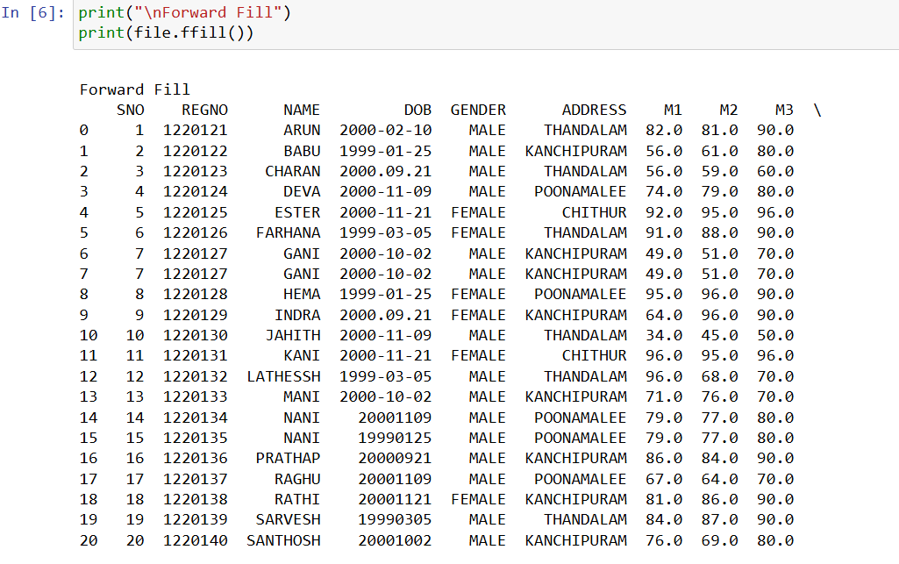
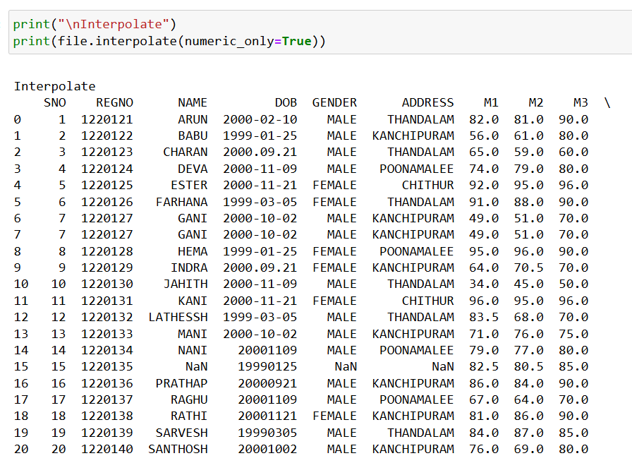

# Exno:1
Data Cleaning Process

# AIM
To read the given data and perform data cleaning and save the cleaned data to a file.

# Explanation
Data cleaning is the process of preparing data for analysis by removing or modifying data that is incorrect ,incompleted , irrelevant , duplicated or improperly formatted. Data cleaning is not simply about erasing data ,but rather finding a way to maximize datasets accuracy without necessarily deleting the information.

# Algorithm
STEP 1: Read the given Data

STEP 2: Get the information about the data

STEP 3: Remove the null values from the data

STEP 4: Save the Clean data to the file

STEP 5: Remove outliers using IQR

STEP 6: Use zscore of to remove outliers

# Coding and Output:

## PROGRAM:
~~~

import pandas as pd

file = pd.read_csv("SAMPLEIDS.csv")

print("Original Data")
print(file)

print("\nDrop NA")
print(file.dropna())

print("\nFill NA")
print(file.fillna(0))

print("\nForward Fill")
print(file.ffill())

print("\nBackward Fill")
print(file.bfill())

print("\nInterpolate")
print(file.interpolate(numeric_only=True))

print("\nMean")
file["M1"] = file["M1"].fillna(file["M1"].mean())
print(file)

print("\nMedian")
file["M2"] = file["M2"].fillna(file["M2"].median())
print(file)

print("\nMode")
file["ADDRESS"] = file["ADDRESS"].fillna(file["ADDRESS"].mode()[0])
print(file)

print("\nRemove Duplicates")
print(file.drop_duplicates())

print("\nWrong Format")
file["DOB"] = pd.to_datetime(file["DOB"], errors='coerce')
print(file)

print("\nWrong Data")
file.loc[file["M1"] > 100, "M1"] = 100
print(file)

~~~

## OUTPUT:

ORIGINAL DATA:

1.dropna():

2.fillna():

3.ffill():

4.Remove Duplicates():

5.Interpolate():

# Result:
Thus, the data cleaning process was successfully completed in Python using Pandas, NumPy, and Matplotlib libraries.
